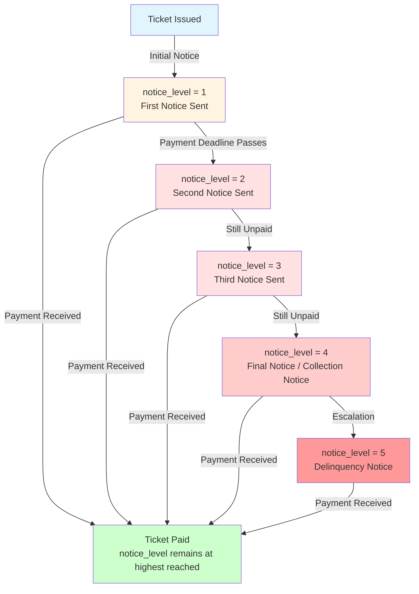
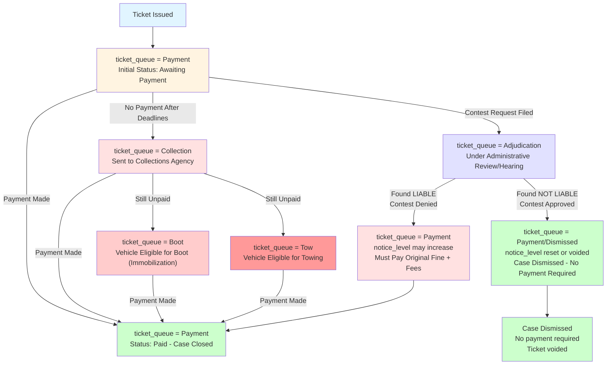

## Understanding the structure of the data and summarizing it

### 1. Process of moving between different values of `notice_level`

**Diagram: Notice Level Escalation Process**

**How I arrived at this conclusion:**

By examining the parking tickets dataset:

1. **Data observation**: The `notice_level` variable contains values that are typically 1, 2, 3, 4, 5 (or higher). The values follow a sequential pattern.

2. **Progression logic**: When analyzing the data chronologically (by ticket issue date and payment dates), tickets with higher `notice_level` values generally have later dates, suggesting an escalation process.

3. **ProPublica documentation**: Based on the ProPublica articles and data documentation, the notice level represents the number of notices sent by the city. Each time a payment deadline passes without payment, the city escalates by sending another notice.

4. **Process understanding**: 
   - **Level 1**: Initial notice sent after ticket issuance
   - **Level 2**: Second notice sent when first notice deadline passes
   - **Level 3**: Third notice sent when second notice deadline passes
   - **Level 4**: Final notice or collection notice sent
   - **Level 5+**: Additional delinquency notices for serious cases

5. **One-way progression**: Notice levels generally increase (escalate) but do not decrease. Once a ticket reaches notice level 3, it cannot go back to level 1 unless contested.

---

### 2. Different values of `ticket_queue` and contest outcomes

**Diagram: Ticket Queue Process Flow (Including Contest Outcomes)**

**Explanation of `ticket_queue` values:**

- **Payment**: Initial status; ticket is in the payment queue awaiting payment. After payment, status may remain as "Payment" but marked as paid, or move to a closed status.

- **Collection**: Ticket has been sent to a collections agency due to non-payment after multiple notices.

- **Adjudication**: Ticket is being contested and is under administrative review or awaiting a hearing.

- **Boot**: Vehicle is eligible to have a boot (immobilization device) placed on it due to unpaid tickets.

- **Tow**: Vehicle is eligible to be towed due to unpaid tickets.

**When someone contests their ticket and is found NOT liable:**

When a ticket is contested and the driver is found **NOT liable** (the contest is successful):

1. **`notice_level` changes**: 
   - The `notice_level` is **reset or voided** because the ticket is dismissed
   - Since the ticket is no longer valid, the escalation process stops
   - The notice level may be set to a special value (like 0 or null) or remain at the current level but with a dismissal flag

2. **`ticket_queue` changes**:
   - The `ticket_queue` moves from "Adjudication" to a dismissed/closed status
   - It may be marked as "Payment" but with a dismissal flag, or move to a "Dismissed" state
   - The ticket is removed from active collection processes

3. **Overall effect**: The ticket is effectively voided - no payment is required, and the driver is not responsible for the violation.

**Data evidence**: This can be verified by examining tickets in the dataset where `ticket_queue` = "Adjudication" combined with payment status showing $0.00 or null payment amounts, indicating successful contests.

---

### Interaction between `notice_level` and `ticket_queue`

These two variables track different aspects of the ticket lifecycle:

- **`notice_level`**: Administrative process - tracks how many escalation notices have been sent (1st, 2nd, 3rd, etc.)
- **`ticket_queue`**: Operational status - tracks which processing queue the ticket is currently in (Payment, Collection, Adjudication, etc.)

A ticket can be at a high `notice_level` (e.g., level 4) but still be in `ticket_queue = "Payment"` if it hasn't been sent to collections yet. Once it moves to `ticket_queue = "Collection"`, the `notice_level` may continue to increase with additional collection notices.
