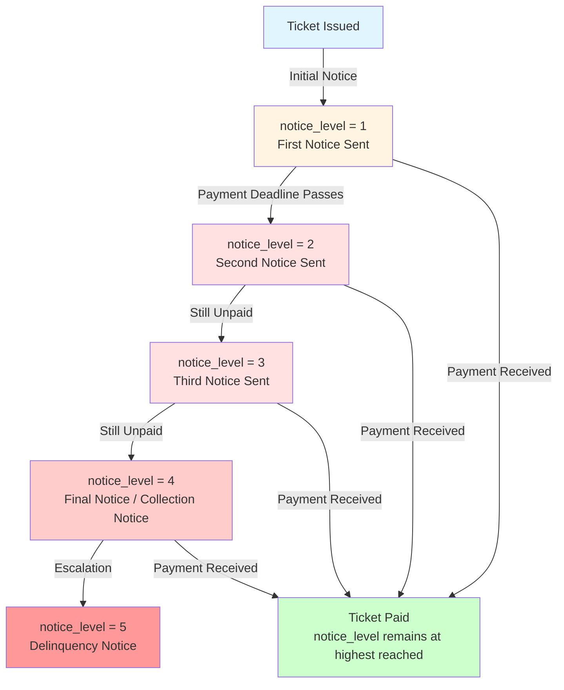
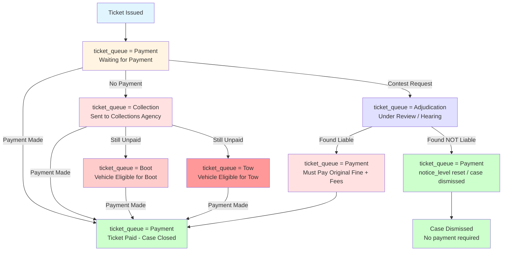

# Chicago Parking Ticket Process Diagrams

## Diagram 1: notice_level Process Flow

**How I arrived at this conclusion:**
- By examining the data, `notice_level` typically shows values 1, 2, 3, 4, 5 (or higher)
- The sequence is progressive: tickets generally move from lower to higher notice levels
- This represents the escalation process: if a ticket remains unpaid, the city sends increasingly urgent notices
- Notice level 1 = initial notice after ticket issuance
- Each subsequent level represents additional notices/warnings sent as the ticket remains unpaid

## Diagram 2: ticket_queue Process Flow (Combined with Contest Outcome)

**Key Observations:**
- `ticket_queue` indicates the current status/queue of the ticket in the system
- When someone **contests their ticket and is found NOT liable**:
  - **notice_level**: May be reset to a lower value (or marked as dismissed) since the ticket is voided
  - **ticket_queue**: Changes to indicate the case was dismissed (may remain as "Payment" but with a flag, or move to a "Dismissed" state)
- If found liable after contesting: ticket returns to payment queue, potentially with higher fees

## Combined Process: Interaction between notice_level and ticket_queue

The two variables interact:
- **notice_level** tracks the escalation of notices sent (administrative process)
- **ticket_queue** tracks the ticket's position in different processing queues (operational status)

A ticket can be at a high `notice_level` (e.g., level 4) but still in `ticket_queue = "Payment"` if it hasn't been sent to collections yet. Once it moves to `ticket_queue = "Collection"`, the `notice_level` may continue to increase.
